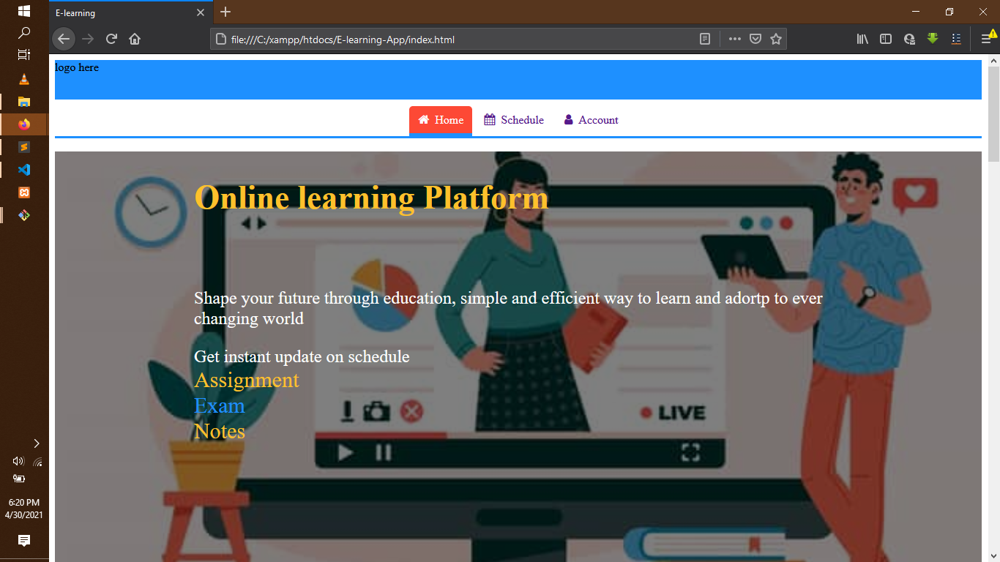
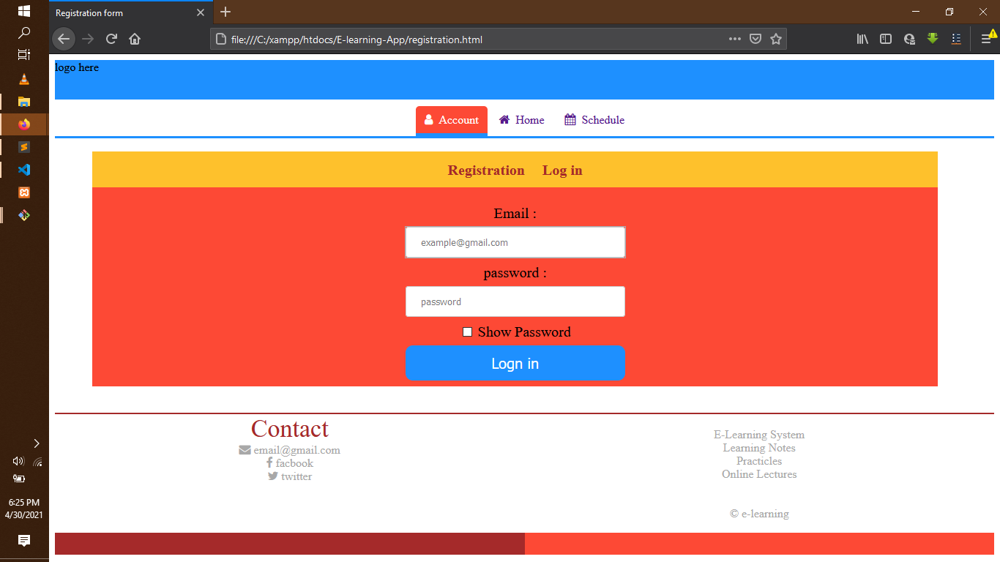
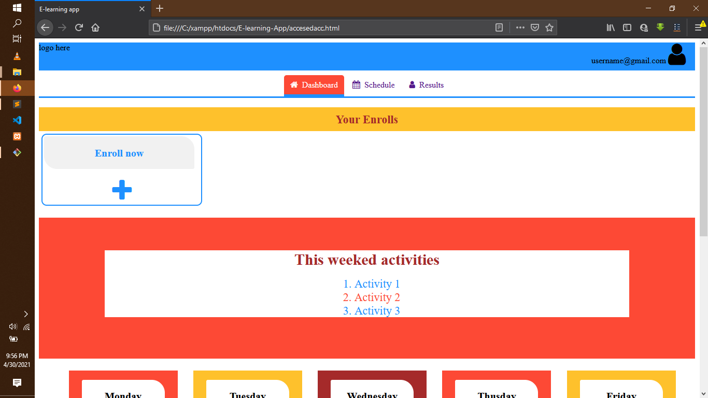

# E-LEARNING PLATFORM 

This an learner driver learning platform. It very easy to use and user freindly.

## Key features and functionality

- Account creation and access
- Coures enrollment self-enrollment
- Quiz/Exam provision
- Learning material provision
- Results generation

### Account creation and access

Easy to create account and a secure way to access account though authentication. 
You can not access any learning material or quiz if not authenticated 

### Coures Enrollment 

Once created an account you can enroll to course of your choice any time
 <i>By a click of a button you are able to enroll </i>

